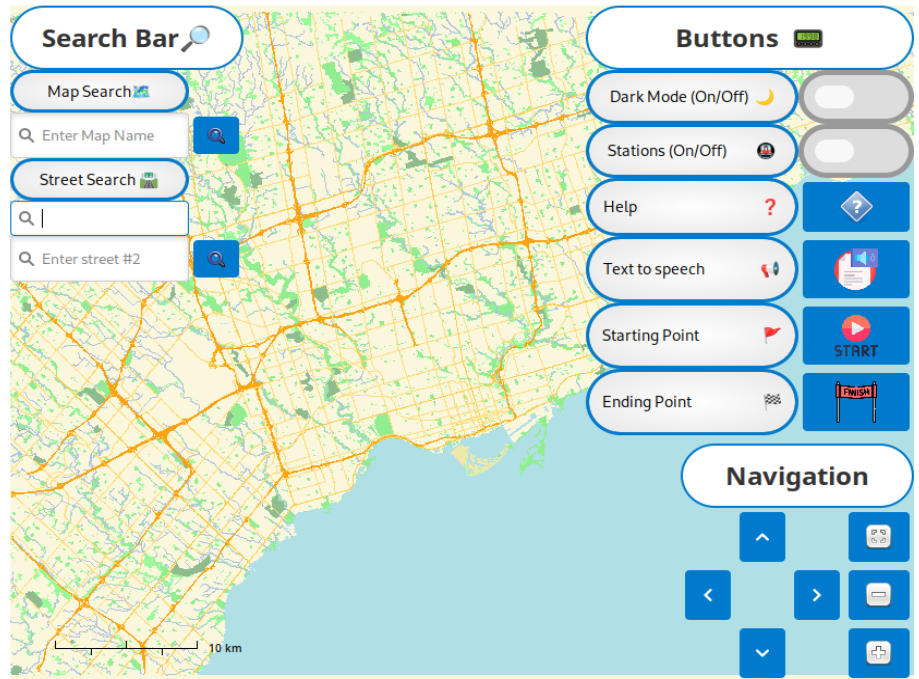
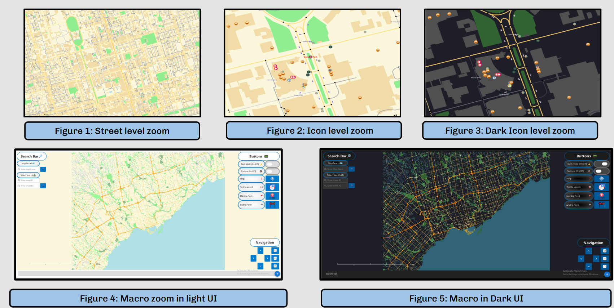
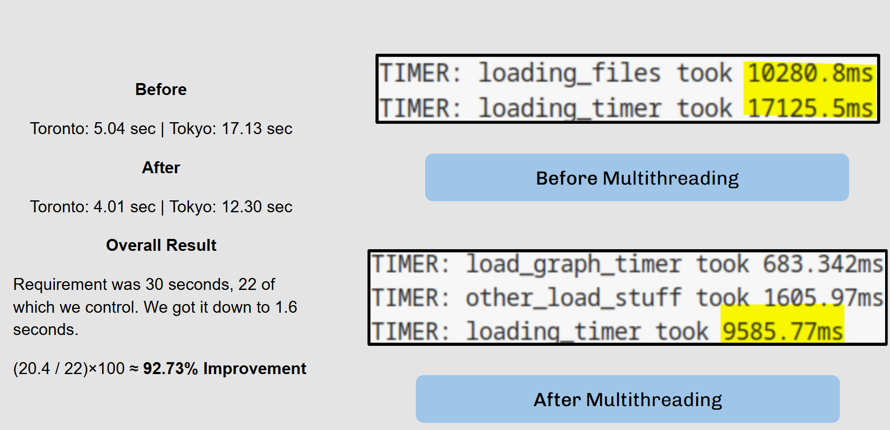

# 🗺️ Navigational GIS  

  
  
  
  
  

An advanced **Geographic Information System (GIS)** built in **C++** using **OpenStreetMap (OSM) APIs**, designed to solve real-world routing and optimization challenges.  
The system integrates **shortest pathfinding, NP-hard courier routing, and interactive visualization** through a **GTK/Glade GUI**.  

---

## 🎯 Overview  
- **Timeline:** Jan 2025 – Apr 2025  
- **Tech Stack:** **C++ (STL)**, **OSM API**, **GTK**, **Glade**, **Git**  
- **Impact:** Ranked in the **top 10% of teams** by delivering a highly efficient, user-friendly GIS platform with advanced pathfinding features.  

---

## 🧠 Technical Highlights  

- **Pathfinding Algorithms:**  
  - Implemented **Dijkstra** and **A\*** for optimal route planning across **10+ cities**.  
  - Enhanced performance with heuristics to reduce search complexity.  

- **NP-Hard Problem Solving:**  
  - Tackled the **Travelling Courier problem** using approximation heuristics.  
  - Efficiently computed multi-stop delivery routes.  

- **Custom GIS Features:**  
  - Route visualization with dynamic overlays.  
  - Real-time recalculations when adjusting start, end, or waypoints.  
  - Support for custom user interactions and constraints.  

- **User Interface (GTK/Glade):**  
  - Built an **interactive UI** for intuitive navigation and visualization.  
  - Users can zoom, pan, and toggle between pathfinding options.  
  - Provided instruction screens and easy-to-use controls.  

---

## 📊 Features Showcase  

### Core Functionality  
- Load maps from **OpenStreetMap API**.  
- Compute shortest paths between any two points.  
- Generate optimized courier delivery routes.  
- Visualize paths with **real-time updates** in a GTK-based UI.  

### Example User Flow  
1. Load a city map (Toronto, New York, etc).  
2. Select source and destination points.  
3. Choose pathfinding method (**Dijkstra or A***).  
4. View the optimal route drawn dynamically.  
5. For courier mode → input delivery points → system computes an optimized path.  

---

## 📸 Complete GIS

 

  

## 🧩 Algorithms 
- **Dijkstra:** Expands all reachable nodes until destination is reached.  
- **A\*:** Uses heuristics to prioritize promising paths → faster route discovery.  
- **Courier Problem:** Iterative heuristics to approximate NP-hard optimal delivery routes.  

---
